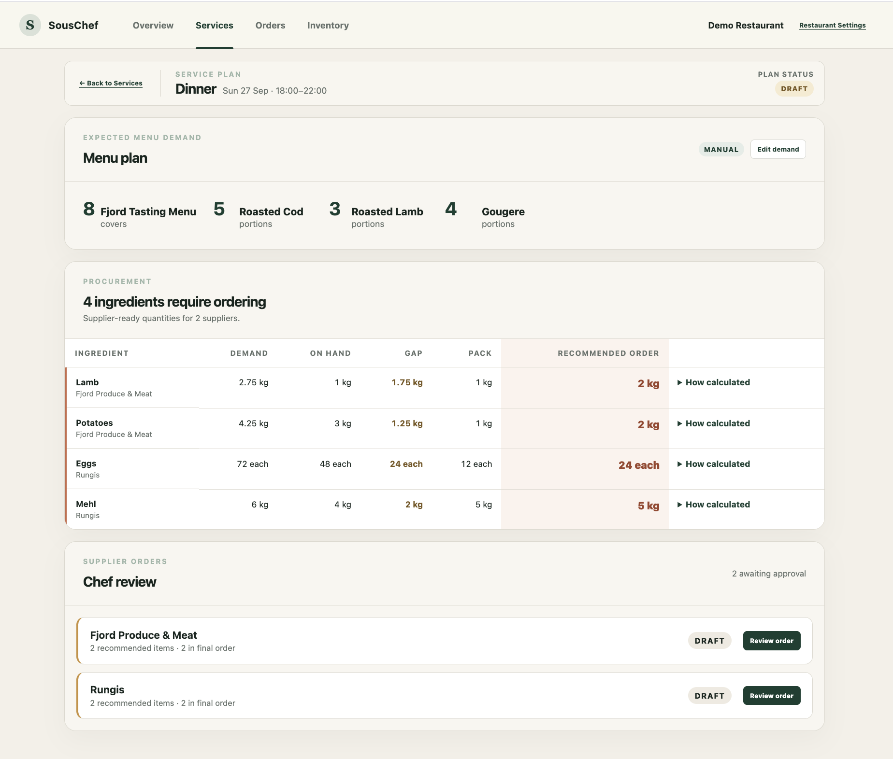
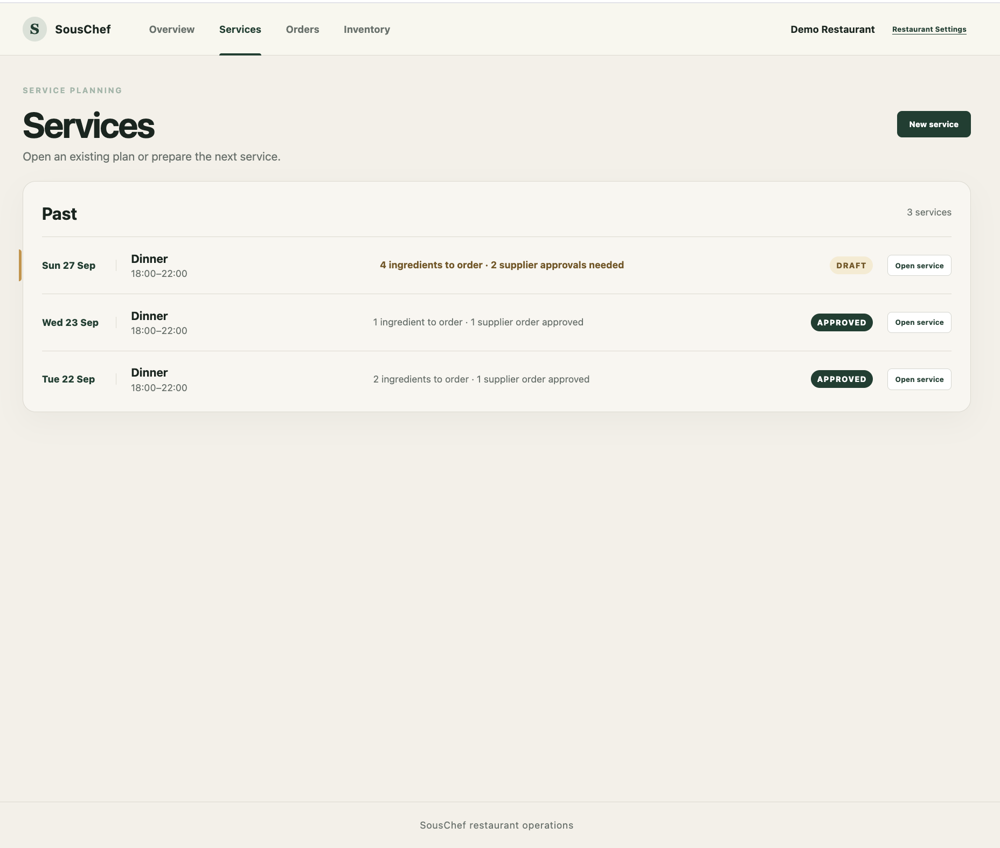
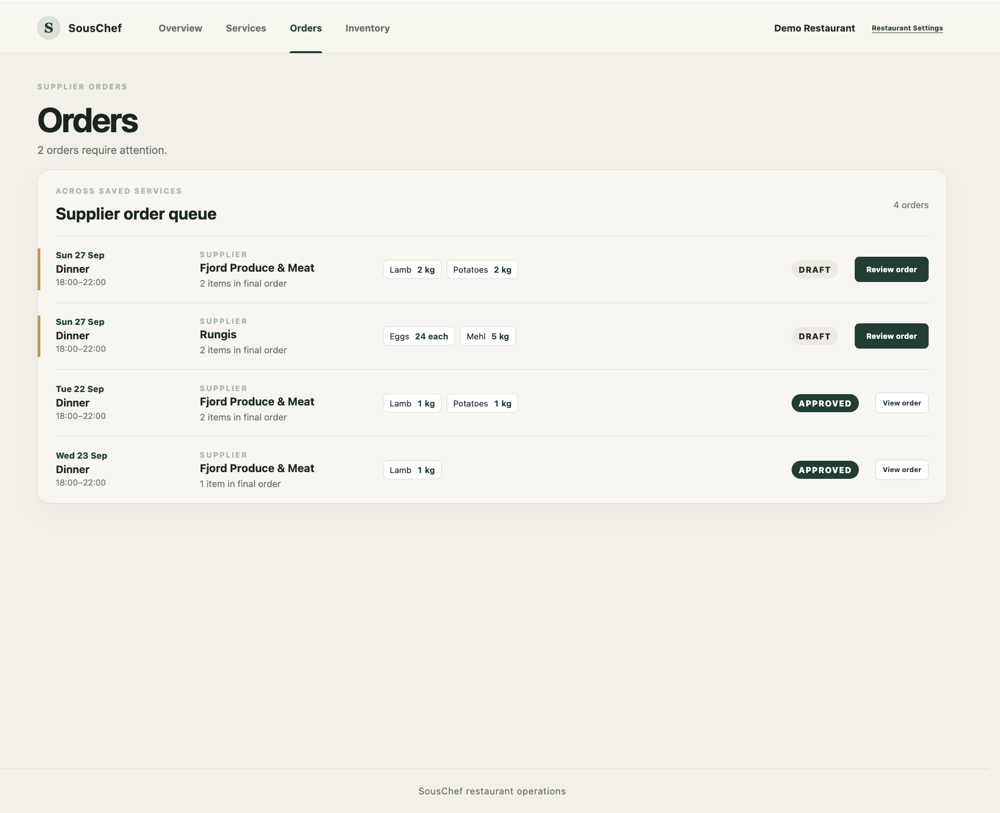

# SousChef

### Procurement intelligence for fine-dining restaurants.

SousChef helps high-end restaurants turn expected guest demand into actionable purchasing decisions.

Instead of chefs manually estimating what to order, SousChef combines reservations, expected walk-ins, menu demand, recipes, current inventory and supplier constraints to recommend what should be purchased for each service.

> Currently in active MVP development and customer validation with fine-dining restaurants.

---

## The problem

Fine-dining procurement is still highly manual.

Chefs need to estimate upcoming covers, anticipate cancellations and walk-ins, translate demand into dishes and ingredients, check available inventory, account for supplier pack sizes, and finally communicate orders to multiple suppliers.

SousChef is being built to connect those decisions into one workflow.

## How it works

**Reservations & historical demand**  
↓  
**Guest demand forecast**  
↓  
**Expected menu demand**  
↓  
**Ingredient requirements**  
↓  
**Current inventory**  
↓  
**Procurement recommendation**  
↓  
**Supplier order & chef approval**

## Product

### From demand to purchasing decisions

SousChef translates expected restaurant demand into ingredient-level purchasing recommendations, accounting for current inventory and supplier pack sizes before presenting supplier-ready quantities for chef review.

### Service planning

Each service is managed as an operational plan, allowing the kitchen to see what requires ordering, which supplier orders need attention, and what has already been approved.

### Supplier order workflow

Procurement recommendations are grouped into supplier-specific orders, giving the kitchen a single workflow to review, adjust and approve purchasing decisions.
## System architecture

SousChef is designed around a modular pipeline:

`Reservation / POS data → Forecasting → Menu demand → Recipe decomposition → Inventory gap → Supplier constraints → Purchase recommendation`

Reservation integrations are being designed around a provider-neutral data model, allowing systems such as restaurant reservation platforms to feed into the forecasting layer.

## Current development

The MVP has been developed iteratively across the core procurement workflow:

- Demand forecasting and ingredient-level procurement engine
- Service planning and inventory management
- Supplier configuration, quantity overrides and chef approval
- Supplier-ready order communication
- Reservation data architecture
- Operational procurement workspace
- Faster restaurant onboarding

The production application and underlying forecasting/procurement implementation remain private while the product is under active development.

## Technology

**TypeScript · React/Vite · Data-driven forecasting · Automated testing**

---

## About

SousChef is an early-stage project exploring how software and demand forecasting can reduce manual procurement work and food waste in high-end restaurants.

Currently focused on customer validation and product development with restaurants in Europe.
